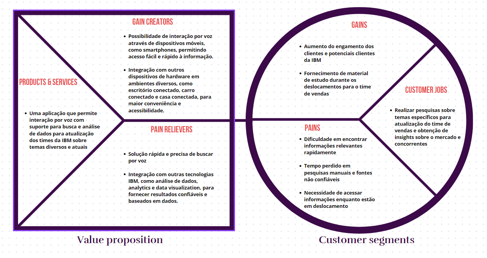
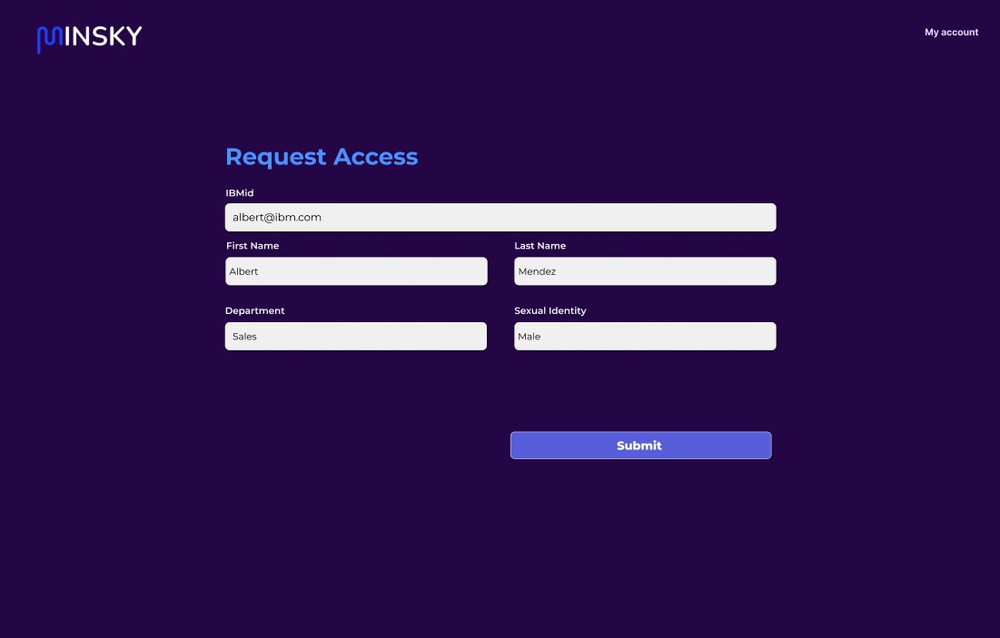

# Inteli - Instituto de Tecnologia e Liderança 

<p align="center">
<a href= "https://www.inteli.edu.br/"></a>
</p>

<br>

# Automação com reconhecimento por voz

Nome do Projeto: Automação com reconhecimento por voz

Nome do Parceiro: IBM

Nome do Grupo: Minsky

Integrantes do grupo: Alan Schipper, Carolina Fricks, Felipe Silberberg, Julia Togni, Stefano Matiotta, Wagner Estevam e Yves Levi.

**Conteúdo**

- [Visão Geral do Projeto](#visão-geral-do-projeto)
- [Entendimento do Negócio](#entendimento-do-neg%C3%B3cio-sprint-1)
- [Entendimento do Design](#entendimento-do-design-sprint-1)
- [Entendimento da Arquitetura do Sistema](#entendimento-do-design-sprint-1)
- [Documentação da Construção do Backend da Solução](#documentação-da-construção-do-backend-da-solução-sprint-3)
- [Documentação da Construção do Frontend da Solução](#documentação-da-construção-do-frontend-da-solução-sprint-4)
- [Documentação Final do Projeto](#documentação-final-do-projeto-sprint-5)
- [Referências](#referências)
- [Apêndice](#apêndice)


# Visão Geral do Projeto


## Parceiro de Negócios

A IBM é uma empresa global de tecnologia e inovação com sede em Armonk, Nova York, nos Estados Unidos servindo a clientes em 170 países. A IBM oferece um extenso portfólio de serviços de tecnologia, consultoria, softwares de Inteligência artificial, Analytics, Finanças, Ciência de Dados, Governança, Integração e Gerenciamento de Dados, Otimização Matemática, FinOps, AIOps, Segurança, Automação e Cloud, além dos mais avançados servidores e supercomputadores do mundo. A IBM investe mais de US$ 6 bilhões por ano em P&D. A área de pesquisa da IBM, o IBM Research, foi reconhecida além das pesquisas de tecnologia comercial e recebeu 5 prêmios Nobel Laureates, 9 prêmios do US National Medals of Technology, 5 prêmios do US National Medals of Science, 6 prêmios Turing e 10 IBMistas nomeados para o US Inventors Hall of Fame. A companhia está por trás de invenções como o PC, o sistema de reserva de viagens SABRE, os códigos de barras - hoje estampados na embalagem de diversos produtos, o super motor de IA Watson, entre muitas outras inovações. 

## Problema

No ambiente digital atual, somos inundados por uma quantidade massiva de informações. Para empresas como a IBM, filtrar e identificar dados relevantes tornou-se um desafio significativo. O processo de pesquisa tradicional, frequentemente, produz resultados muito amplos, tornando-se ineficiente para decisões de negócios rápidas e precisas. Assim, a demanda por métodos de pesquisa mais direcionados e específicos é crescente.

## Objetivos

#### Objetivos gerais

O objetivo geral do projeto é desenvolver um motor de IA que permita buscas através de comandos de voz para atualização de temas relevantes para a equipe de vendas e de marketing. Isso oferece vantagens para o time de vendas, que muitas vezes está em trânsito, ao permitir interações por meio de smartphones e potencialmente integrar-se com diversos dispositivos de hardware em diferentes ambientes, como escritórios conectados, carros conectados e casas inteligentes.

#### Objetivos específicos

Os objetivos específicos do projeto incluem:

1. Desenvolver uma aplicação interativa onde os usuários possam formular perguntas em linguagem natural usando comandos de voz ou texto.

2. Integrar tecnologias de IA, Ciência de Dados e Visualização de Dados da IBM, como Watson Discovery, Watson Assistant, Watson Studio e Cognos Analytics.

3. Implementar um mecanismo de busca que utiliza tecnologias de NLP para analisar documentos e identificar informações relevantes.

4. Apresentar os resultados de busca de maneira compreensível e contextualizada, incluindo o que empresas concorrentes da IBM estão falando sobre o tema.

5. Incorporar a capacidade de analisar sentimentos para avaliar a atitude das empresas em relação ao tema.

6. Criar uma interface web para acesso via navegador e permitir a interação por texto.

7. Implementar um resumo de texto gerado por IA para sintetizar as informações dos documentos.

8. Criar um protótipo funcional ao final do projeto que demonstre a capacidade da solução.

## Partes Interessadas 

Stakeholders são partes interessadas em um projeto, organização ou iniciativa. Eles têm influência direta ou indireta sobre o sucesso do empreendimento.

Na aplicação Minksy, os funcionários da IBM, tanto da equipe de marketing quanto da equipe de vendas, desempenham um papel fundamental como partes interessadas. Eles representam os usuários finais da solução e têm o desejo de acessar respostas confiáveis de maneira fácil e rápida para otimizar suas atividades diárias.
Outro stakeholder é o time de desenvolvimento. São os criadores da solução e desempenham um papel essencial em seu desenvolvimento e manutenção.

# Requisitos


## Requisitos Funcionais

Sabendo que se define por “Requisitos Funcionais“ aqueles que incluem informações sobre as funcionalidades esperadas do software, além de restrições e limitações do sistema. São compostos por duas partes: função (que se refere ao que o sistema faz) e comportamento (que refere-se como o sistema faz isso) (VISURE, 2023). Dessa forma, viu-se a necessidade de elencar esses, de acordo com a solução.

| ID   | Requisitos Funcionais                                                                                                          |
|------|------------------------------------------------------------------------------------------------------------------------------------|
| RF1  | A aplicação deve permitir interação por texto                                                                                    |
| RF2  | A aplicação deve permitir interação por voz                                                                                      |
| RF3  | A aplicação deve fornecer o título dos documentos/ matérias                                                                      |
| RF4  | A aplicação deve oferecer as fontes das informações                                                                              |
| RF5  | A aplicação deve retornar fonte, data da informação/notícia                                                                      |
| RF6  | A aplicação deve fornecer respostas rápidas e relevantes às solicitações do usuário                                              |
| RF7  | A aplicação deve ser capaz de realizar o reconhecimento de voz, garantindo a compreensão exata dos comandos do usuário.         |
| RF8  | A aplicação deve entender diferentes sotaques e conotações linguisticas                                                          |
| RF9 | A aplicação deverá ser usada apenas por usuários da IBM.                                                                        |
| RF10 | A aplicação deve ser capaz de reconhecer e responder a comandos em português e inglês, oferecendo suporte a uma ampla variedade de usuários. |
| RF11 |  A aplicação deve ser capaz de lidar com consultas complexas e múltiplos níveis de interação, permitindo respostas resumidas e detalhadas contendo gráficos.                                      |


## Requisitos não Funcionais

Os requisitos não funcionais referem-se aos atributos de qualidade do sistema. Geralmente, esses são indicados com adjetivos de desempenho, segurança e escalabilidade. Para a aplicação em questão foram elencados os seguintes requisitos:


| ID    | Requisitos Não Funcionais                                                                                                       |
|-------|------------------------------------------------------------------------------------------------------------------------------------|
| RNF1  | A aplicação deve retornar a resposta em até 10s para o usuário.                                                                                 |
| RNF2  | O sistema deve manter um desempenho consistente mesmo com o aumento do número de usuários.                     |
| RNF3  | A aplicação deve estar disponível com o máximo de indisponibilidade de 1h, com monitoramento contínuo para garantir a alta disponibilidade.                                                                                           |
| RNF4  | O sistema deve ser capaz de lidar com um aumento na quantidade de consultas simultâneas.                                        |
| RNF5  | O sistema deve ser capaz de se integrar de forma eficiente com sistemas legados.                                                                                     |
| RNF6  | O sistema deve fornecer como resposta fontes confiáveis, trazendo a fonte daquelas informações                                                    |
| RNF7  | A aplicação deve garantir a conformidade com as regulamentações de proteção de dados                                                                                                    |
| RNF8  | A aplicação deve ter um tempo de inatividade planejado mínimo para manutenção.  |
| RNF9  | A precisão do reconhecimento de voz deve ser superior a 95%, garantindo uma compreensão correta dos comandos do usuário.        |
| RNF10 | O tempo médio de resposta da aplicação não deve exceder 10 segundos para fornecer uma experiência de interação rápida e sem interrupções. |
| RNF11 | A aplicação deve ser compatível com múltiplas plataformas, incluindo Web e Mobile, confirmado por testes de compatibilidade. |
| RNF12  | A aplicação deve ser portátil                                                                                               |
| RNF13 | O sistema deve permitir que apenas funcionários da IBM possam interagir com a aplicação  |


# Entendimento do Negócio (Sprint 1)


## Matriz de avaliação de valor Oceano Azul

A matriz de oceano azul é uma ferramenta de análise estratégica que ajuda a identificar oportunidades de mercado inexploradas e a criar novas demandas. Ela é usada para definir a posição competitiva de uma empresa em relação aos concorrentes e criar um plano de ação para diferenciar a oferta da empresa e criar um novo mercado. A matriz ajuda as empresas a encontrar novas oportunidades de crescimento, reduzir a concorrência e aumentar a lucratividade.


<center> Fonte: Elaborado pelo próprio autor (2023).</center>

### Análise da Indústria

Análise da indústria (Modelo de 5 Forças de Porter) em relação ao cenário da empresa parceira.

### Canvas Proposta de Valor

O Canvas Proposta de Valor é um template de negócios que ajuda a entender o valor da sua solução para a empresa, englobando seus pontos fortes e principalmente, como esses ajudam a resolver dores do cliente. É possível visualizar a proposta de valor na imagem a seguir:


<center> Fonte: Elaborado pelo próprio autor (2023).</center>


### Matriz de Risco

Também chamada de matriz de probabilidade e impacto, a matriz mapeia os riscos do projeto, sejam eles tanto riscos de ameaças quanto de oportunidades. Por ser uma ferramenta útil para gerenciar os riscos operacionais existentes em um projeto, foi elaborado uma Matriz de Riscos com base na proposta de solução elaborada pelo time de desenvolvimento, que pode ser visualizada na figura abaixo:


<center> Fonte: Elaborado pelo próprio autor (2023).</center>

### Análise Financeira

Analise financeira preditiva de custo, feita com estimativa da IBM, considerando um periodo de 220 horas de funcionamento por mes.

| Componente                   | Função               | Valor mensal  |
|-------------------------|----------------------|---------------|
| Watson Speech to Text   | Licença de Software  | $264,00       |
| Watson Assistant        | Licença de software  | $6.090,00     |
| AWS EC2      | Hospedagem                    | $700,00     |
| Valor Total Mensal       | -                    | $7.054,00    |
| Valor Total Anual       | -                    | $84.648,00    |

# Entendimento do Design (Sprint 1)

### Estudo sobre o usuário do sistema

Personas são criadas para entender o usuário do sistema. Elas são a representação do público alvo para entender as motivações e necessidades dos mesmo.<br>
</img>
</img><br>
Link para vizualizar com mais qualidade: https://www.figma.com/file/yLjcieTVkES3a2XwMjGNHJ/Grupo-4-M7?type=design&node-id=0-1&mode=design&t=P5YpFlOo0OMH9Sjx-0.<br>

### Experiências que o usuário deverá passar ao utilizar o sistema

Para visualizar a experiência do usuário, mapeamos sua jornada atual de pesquisa. Nela apresentamos as tarefas, mindset durante a execução, os pontos de dores do usuário e as oportunidades que podemos explorar na nossa aplicação.</br>

</img>
</img><br>

Link para vizualizar com mais qualidade: https://www.figma.com/file/yLjcieTVkES3a2XwMjGNHJ/Grupo-4-M7?type=design&node-id=0-1&mode=design&t=P5YpFlOo0OMH9Sjx-0.<br>

### Proposta de UX para o sistema

Pensando na usabilidade do usuário na aplicação, e as ideias de benchmark que o parceiro trouxe (Google), idealizamos um visual minimalista.<br>
</img>

Link para vizualizar com mais qualidade: https://www.figma.com/file/yLjcieTVkES3a2XwMjGNHJ/Grupo-4-M7?type=design&node-id=0-1&mode=design&t=P5YpFlOo0OMH9Sjx-0.<br>

### Pilha de tecnologias para implementar a proposta de UX

Para implementar a proposta de UX, é necessário selecionar uma pilha de tecnologias apropriada. Pensando nisso, utilizaremos tecnologias que estão sendo constantemente atualizadas e amplamente utilizadas no mercado, a fim de facilitar a manutenção e escalabilidade da aplicação, tanto na questão dos diferentes dispositivos que serão aceitos, quanto na perpetuidade ao decorrer do tempo.

Dito isso, utilizaremos as seguintes tecnologias para desenvolvimento da proposta de UX:

| Tecnologia                   | Descrição                                             |     
|-------------------------|------------------------------------------------------------|
| JavaScript              | Linguagem de programação escolhida para o desenvolvimento  |
| React                   | Framework escolhido devido a facilidade e adaptabilidade   |
| Figma                   | Plataforma utilizada para montagem do design               |
| Tailwind css            | Biblioteca utilizada para facilitar a estilização          |

Podendo ser disponibilizadas nos seguintes dispositivos, com margem para ampliação para Tablets, IPads, entre outros:

| Dispositivos            |    
|-------------------------|
| Mobile                  |
| Desktop                 |


# Entendimento da Arquitetura do Sistema (Sprint 1)

## Versão 1

Desenho da arquitetura geral para solução "Assistente de Voz".

</img>

## Versão Final 


### Componentes e requisitos

Descrição componentes e requisitos.

</img>

# Documentação do Sistema NLP (Sprint 2)

## API para implementar etapa de Speech to Text

Todas nossas rotas encontram-se documentadas no swagger:

</img>

### API Speech-to-Text

```
/speech-to-text:
  post:
    tags: [Speech-To-Text]
    security:
      - bearerAuth: []
    requestBody:
      required: true
      content:
        audio/wav:
          schema:
            type: string
            format: binary
    responses:
      200:
        description: Áudio como texto
        content:
          text:
            example:
              "Olá, este é um áudio convertido. Teste!"
      400:
        description: Requisição inválida
        content:
          text:
            example:
              "Arquivo de áudio necessário"
      500:
        description: Erro interno do servidor 
```

### Descrição da API - Conversão de Áudio em Texto

Esta API oferece a funcionalidade de converter arquivos de áudio em texto por meio de um endpoint dedicado.

**Endpoints Disponíveis:**

- `POST/speech-to-text`

**Métodos HTTP Aceitos:**

- POST

**Autenticação:**

- A autenticação é feita por meio do token Bearer (`bearerAuth`).

**Parâmetros de Entrada Necessários:**

- `audio` (multipart/form-data): Um arquivo de áudio no formato WAV. Este parâmetro é obrigatório.

**Requisitos Adicionais:**

- Arquivo de áudio esteja no formato correto (WAV).
- A autenticação por token Bearer é necessária para acessar o endpoint.

**Respostas Esperadas:**

- **Status 200 OK**: A conversão de áudio para texto foi bem-sucedida. A resposta contém o texto extraído do áudio no formato "text".

  Exemplo de resposta:
  ```json
  {
    "text": "Olá, este é um áudio convertido. Teste!"
  }
  ```
- **Status 400 OK**: Requisição inválida.

  Exemplo de resposta:
  ```json
  {
    "text": "Arquivo de áudio necessário"
  }
  ```
- **Status 500 Internal Server Error**: Ocorreu um erro interno no servidor.

  Exemplo de resposta:
  ```json
  {
    "error": "Erro interno do servidor durante o processamento do áudio"
  }
  ```

# Algoritmo de NLP utilizado e sua implementação

## Processamento de Linguagem Natural (NLP)

O processamento de linguagem natural (NLP) é uma área da inteligência artificial que se concentra na interação entre computadores e linguagem humana. A abordagem para nosso sistema NLP envolve as seguintes etapas:

1. **Coleta de Dados:** O primeiro passo é reunir os dados de texto relevantes para o comando em questão. Esses dados são obtidos do Google, através da conexão com API.

2. **Pré-processamento de Texto:** Inclui a conversão para minúsculas, tokenização (divisão do texto em palavras ou frases), remoção de stopwords (palavras comuns que não contribuem significativamente para a análise), e aplicação de stemming ou lematização (redução de palavras à sua forma raiz).

3. **Integração com Aplicativo:** Com os resultados do processamento de texto são integrados no aplicativo, onde podem ser usados para tomar decisões, automatizar tarefas ou fornecer insights.


</img>

[Visualizar o Notebook](../src/notebook/pln.ipynb)

## Processo de deploy do algoritmo em nuvem comercial

### Deploy

#### Passo 1: Preparação do Ambiente

- Crie uma conta na AWS: Se você ainda não possui uma conta AWS, acesse [https://aws.amazon.com/pt/](https://aws.amazon.com/pt/) e siga as instruções para criar uma conta.

- Acesse o Console da AWS: Faça login no Console da AWS usando suas credenciais.

#### Passo 2: Criação de um Ambiente de Desenvolvimento

- Crie uma instância EC2: Vamos usar uma instância EC2 (Amazon Elastic Compute Cloud) para implantar o seu algoritmo. No Console da AWS, vá para o serviço EC2 e clique em "Launch Instance" para criar uma instância.
  - Escolha uma AMI (Amazon Machine Image) adequada para sua aplicação.
  - Selecione um tipo de instância com recursos adequados às necessidades do seu algoritmo.
  - Configure as opções de segurança para permitir o acesso SSH à instância.

- Conecte-se à Instância: Use SSH para se conectar à sua instância EC2 a partir do seu terminal local. Você pode encontrar as instruções de conexão SSH na página de detalhes da instância no Console da AWS.

#### Passo 3: Preparação do Ambiente na Instância EC2

- Instale as Dependências: Na instância EC2, instale as bibliotecas e dependências necessárias para o seu algoritmo de NLP. Você pode usar o gerenciador de pacotes pip para isso.

- Transfira seu Código: Transfira seu código desenvolvido no Colab (ou qualquer código, modelos ou arquivos necessários) para a instância EC2 usando SCP ou outra ferramenta de transferência de arquivos.

#### Passo 4: Transferência do código usando SCP

Para transferir o código desenvolvido no Colab, pode-se usar o SCP (Secure Copy Protocol) e os seguintes passos podem ser seguidos:

- Abra o Terminal Local: Abra um terminal ou prompt de comando no seu computador local, onde você possui o código fonte que deseja transferir.

- Use o Comando SCP: O comando SCP permite que você copie arquivos de e para servidores remotos de forma segura. A estrutura básica do comando SCP é a seguinte:

 ```scp -i caminho/para/sua/chave.pem caminho/do/seu/arquivo usuario@ip_da_instancia:/caminho/de/destino/na/instancia```


 -i caminho/para/sua/chave.pem: Substitua pelo caminho para a chave privada (.pem) que você usará para autenticar na instância EC2. Essa chave deve ser a mesma que você usou para conectar-se à instância via SSH.

 caminho/do/seu/arquivo: Substitua pelo caminho completo para o arquivo ou diretório local que deseja transferir.
	
 usuario: Substitua pelo nome de usuário da instância EC2 (geralmente, é "ec2-user" para instâncias Amazon Linux).

 ip_da_instancia: Substitua pelo endereço IP público da sua instância EC2.

 /caminho/de/destino/na/instancia: Substitua pelo caminho de destino na instância onde você deseja colocar os arquivos.

- Execute o Comando SCP: Execute o comando SCP no seu terminal local. Por exemplo, se você deseja transferir um arquivo chamado "meu_codigo.py" para a pasta "/home/ec2-user/projeto" na instância EC2, o comando pode ser semelhante ao seguinte:

```scp -i /caminho/para/sua/chave.pem meu_codigo.py ec2-user@ip_da_instancia:/home/ec2-user/projeto/```

- Digite a Senha ou Forneça a Autenticação da Chave Privada: Dependendo da configuração da sua chave privada, você pode precisar digitar a senha associada a ela ou autenticar-se usando a chave privada. Certifique-se de que a chave privada (.pem) tenha permissões restritas de acesso.

- Aguarde a Transferência: O SCP copiará o arquivo ou diretório do seu computador local para a instância EC2. Aguarde até que a transferência seja concluída.


#### Passo 5: Implantação do Algoritmo

- Execute seu Código: Execute o seu código na instância EC2 para pré-processar, vetorizar ou realizar qualquer processamento necessário nos dados de entrada. Certifique-se de que o seu código esteja funcionando corretamente na nuvem.

#### Passo 6: Expondo como um Serviço (Opcional)

- Crie um Serviço Web (API): Se você deseja expor seu algoritmo como um serviço web acessível pela web, você pode configurar um servidor web (por exemplo, usando Flask) na instância EC2. Isso permitirá que você crie APIs para acessar seu algoritmo.

#### Passo 7: Teste e Monitoramento

- Teste o Algoritmo: Realize testes rigorosos para garantir que o seu algoritmo esteja funcionando conforme o esperado na nuvem.

- Configure Monitoramento: Implemente estratégias de monitoramento para acompanhar o desempenho e a disponibilidade do seu algoritmo na nuvem.

#### Passo 8: Escala e Otimização (Opcional)

- Dimensione Recursos: Dependendo da demanda, você pode dimensionar os recursos da sua instância EC2 para atender a picos de carga.

- Otimização: Avalie o desempenho e otimize seu algoritmo, ajustando os recursos ou otimizando o código, conforme necessário.


## API para receber os áudios enviados pelo usuário

```
/transcribe:
	post:
	tags: [Speech-To-Text]
	security:
	- bearerAuth: []
	parameters:
		name: audioFile
		description: MPEG Audio File
		required: true
		schema:
		type: string
		format: binary
	requestBody:
		required: true
		content:
			audio/mpeg:
				schema:
					type: string
					format: binary
	responses:
		200:
			description: Upload audio
			content:
			text:
				example:
				"Audio enviado com sucesso"

		500:
		description: Internal server error
```

#### Descrição da API - Recebendo Áudios

Esta API permite aos usuários fazer o upload de arquivos de áudio para posterior transcrição em texto.

**Endpoints Disponíveis:**

- `POST/transcribe`

**Métodos HTTP Aceitos:**

- POST

**Autenticação:**

- A autenticação é feita por meio do token Bearer (`bearerAuth`).

**Parâmetros de Entrada Necessários:**

- `audioFile` (multipart/form-data): Um arquivo de áudio no formato MPEG. Este parâmetro é obrigatório.

**Formatos de Áudio Suportados:**

- MPEG Audio File

**Requisitos Adicionais:**

- Arquivo de áudio esteja no formato correto (MPEG).
- A autenticação por token Bearer é necessária para acessar o endpoint.

**Respostas Esperadas:**

- **Status 200 OK**: O arquivo de áudio foi enviado com sucesso.

  Exemplo de resposta:
  ```json
  {
    "message": "Audio enviado com sucesso"
  }
  ```
- **Status 500 Internal Server Error**: Ocorreu um erro interno no servidor durante o processamento do arquivo de áudio.
  Exemplo de resposta:
  ```json
  {
    "error": "Erro interno do servidor durante o processamento do áudio"
  }
  ```

Network e Teste Rota /transcribe
</img>

Network e Teste Rota /analyze
</img>

Exemplo integrando a API do Google Search
</img>


# Documentação da Construção do Backend da Solução (Sprint 3)

Webhooks são uma maneira útil e simples de permitir a comunicação entre aplicativos na web. Um webhook (também chamado de web callback ou HTTP push API) é uma maneira para um aplicativo fornecer outras aplicações com informações em tempo real. Um webhook oferece informações a outros aplicativos assim que acontecem, o que os torna uma fonte essencial de informações atualizadas.

Normalmente, um webhook é uma requisição HTTP que é acionada quando algum evento específico ocorre. O servidor faz uma requisição HTTP POST para a URL configurada para o webhook, contendo informações sobre o evento.

Este Backend consiste em processar a comunicação de entrada e saída, lidar com solicitações e fornecer respostas. O servidor foi projetado para lidar com webhooks de processamento de texto e voz para texto, usando Node.js, Kafka e o banco de dados NoSQL MongoDb.


## Backend preparado para receber os Webhooks de processamento de texto

A API aceita solicitações GET na rota '/webhook/text'. Os detalhes do endpoint são os seguintes:

*/webhook/text:* Este é um endpoint GET que obtém notificações do Kafka.

- Requer autenticação.
- Retorna "200 OK" para uma solicitação bem-sucedida, "401 Unauthorized" para solicitações não autorizadas e "500 Internal -- Server Error" para erros do servidor.

**Testes do Webhook Implementado**

Resposta do Webhook com o Ok, ou seja, solicitação bem-sucedida


Mensagem consumida pelo microserviço


### Estrutura dos dados recebidos:

A API de processamento de texto espera que os dados sejam enviados no formato JSON, que contém um campo text, 		cujo valor é uma string.

A resposta da API do processamento de texto inclui informações analíticas sobre o texto, incluindo o número de 		unidades de texto, caracteres de texto e recursos utilizados, além de informações sobre o sentimento do documento, 	a linguagem utilizada, palavras-chave relevantes, entidades mencionadas e categorias do texto.

## Backend preparado para receber os Webhooks de processamento de voz para texto

A API aceita solicitações GET na rota '/webhook/voice'. Os detalhes do endpoint são os seguintes:

*/webhook/voice:* Este é um endpoint GET que obtém notificações do Kafka. As notificações são enviadas em formato JSON.

Retorna um status 200 OK para uma solicitação bem-sucedida, 401 Unauthorized para solicitações não autorizadas e 500 Internal Server Error para erros do servidor.

**Testes do Webhook Implementado**

Aqui o webhook se comporta da mesma maneira que o texto, servindo assim para o texto captado do áudio 

Resposta do Webhook com o Ok, ou seja, solicitação bem-sucedida


Mensagem consumida pelo microserviço


### Integração com serviço de conversão de voz para texto:

O backend se integra com o serviço de conversão de voz para texto da IBM utilizando a API IBM Watson. O áudio é enviado para a API IBM Watson depois de ser convertido de .mp3 para .wav.

Depois que a API processa o áudio, ela retorna uma transcrição do áudio.

Os resultados são entregues ao parceiro como um fluxo de eventos, onde cada evento representa algum tipo de reconhecimento de fala, como o reconhecimento de uma palavra ou frase.

## Sistema de troca de mensagens para notificar os eventos

**Descrição do sistema de mensagens:** </br>
</br>
***Configuração do Kafka:***</br>
Configuração Kafka especifica o servidor Kafka (broker) ao qual se conecta e as configurações do serviço. 

***Consumidor e Produtor Kafka:***</br>
Nesse projeto os serviços são tanto produtores quanto consumidores de mensagens.

***Subscrição em um Tópico:***</br>
O consumidor do Kafka se conecta ao Kafka e se inscreve em um tópico específico chamado "alert-topic". Isso significa que o consumidor estará pronto para receber mensagens deste tópico e, ao usar a opção fromBeginning, ele começa a consumir as mensagens desde o início do tópico.

***Processamento de Mensagens:***</br>
Quando o consumidor recebe uma mensagem do tópico "alert-topic", ele executa uma função de *callback* para processar essa mensagem. Nesse caso, a mensagem é impressa no console e, em seguida, é encaminhada para outro tópico chamado "alert-response".


**3.2 Detalhes sobre produtores e consumidores:** </br>
</br>
**Configuração Kafka:**</br>
```json
import { Kafka, logLevel } from "kafkajs";

export const kafka = new Kafka({
  clientId: "api",
  brokers: ["localhost:9092"],
  logLevel: logLevel.WARN,
  retry: {
    initialRetryTime: 300,
    retries: 10,
  },
});
```

**Serviços Kafka:**</br>

```
const consumer = kafka.consumer({ groupId: "alert-group" });

const producer = kafka.producer();

async function run() {
  await consumer.connect();
  await consumer.subscribe({ topic: "alert-topic", fromBeginning: true });

  await consumer.run({
    eachMessage: async ({ topic, partition, message }) => {
      console.log({
        offset: message.offset,
        value: message.value.toString(),
      });

        const payload = JSON.parse(message.value);
      await producer.connect();

      producer.send({
        topic: "alert-response",
        messages: [{ value: payload }],
      });

      await producer.disconnect();
    },
  });
}
```


## Frontend mínimo para realizar o teste da implementação do modelo

**- Descrição da Interface do Usuário**</br>
A interface do usuário do aplicativo é projetada de forma minimalista para facilidade de uso. </br>

Ela consiste nos seguintes componentes:</br>
- Campo de Entrada de Texto: Um campo de entrada de texto onde o usuário pode inserir o texto que deseja pesquisar.</br>
- Botão de Gravação de Áudio: Um botão que permite ao usuário gravar áudio diretamente do dispositivo para a realização da pesquisa.

**- Integração com as APIs do Backend**</br>

***Envio de Dados de Texto para Pesquisa:***

Quando o usuário insere o texto no campo de entrada, o frontend faz uma chamada de API do Google ao backend, enviando o texto para realizar a pesquisa.</br>

***Gravação e Envio de Áudio para Transcrição:***

Quando o usuário pressiona o botão de gravação de áudio, o frontend inicia a gravação de áudio e ao pressionar novamente o frontend termina a gravação.
Após a gravação ser concluída, o frontend faz uma chamada de API ao backend, enviando o áudio gravado para ser convertido para o formato mp3 e, após isso, envio para o Speech-To-Text </br>


***Recebimento dos Resultados:***

O backend processa a solicitação. Em seguida, envia os resultados de volta para o frontend. O frontend exibe os resultados na interface do usuário para que o usuário possa visualizar os resultados da pesquisa.</br>


**- Instruções de Uso e Testes**</br>
Aqui estão as instruções detalhadas sobre como utilizar o frontend para testar a implementação do modelo de transcrição de áudio:

- Para Texto:</br>
No campo de entrada de texto, insira o texto que deseja transcrever em formato de áudio.
Clique no botão de envio para enviar o texto para o backend.
Aguarde alguns instantes enquanto o backend processa a solicitação e realiza a pesquisa.
Os resultados da pesquisa serão exibidos na interface do usuário, na forma de texto contendo a fonte e data das informações.

- Para Áudio:</br>
Pressione o botão de gravação de áudio para iniciar a gravação. Fale o texto que deseja pesquisar.
Solte o botão da gravação, para parar a gravação. O áudio será enviado para o backend, para a transformação do formato e transcrição para texto. Esse texto é enviado para a API do Google. Os resultados da pesquisa serão exibidos na interface do usuário, na forma de texto contendo a fonte e data das informações.

# Documentação da Construção do Frontend da Solução (Sprint 4)

## Implementação do frontend com o framework ou biblioteca desejada
#### 1. Implementação do frontend
A implementação do frontend foi feita usando o framework React.

#### 1.1 Classificação de requisitos:
**Requisitos de Interação:**
Esses requisitos descrevem como o usuário interage com a aplicação.
- RF1: A aplicação deve permitir interação por texto.
- RF2: A aplicação deve permitir interação por voz.
- RF7: A aplicação deve ser capaz de realizar o reconhecimento de voz, garantindo a compreensão exata dos comandos do usuário.
- RF8: A aplicação deve entender diferentes sotaques e conotações linguísticas.
- RF10: A aplicação deve ser capaz de reconhecer e responder a comandos em português e inglês, oferecendo suporte a uma ampla variedade de usuários


**Requisitos de Informação:**
Estes requisitos definem quais informações o sistema deve fornecer, manipular ou armazenar.
- RF3: A aplicação deve fornecer o título dos documentos/matrizes.
- RF4: A aplicação deve oferecer as fontes das informações.
- RF5: A aplicação deve retornar fonte, data da informação/notícia.
  
**Requisitos de Desempenho:**
Estes requisitos especificam o desempenho desejado do sistema.
- RF6: A aplicação deve fornecer respostas rápidas e relevantes às solicitações do usuário.
- RF11: A aplicação deve ser capaz de lidar com consultas complexas e múltiplos níveis de interação, permitindo respostas resumidas e detalhadas contendo gráficos.
  
**Requisitos de Restrição:**
Estes requisitos definem limitações ou restrições sobre o design e implementação do sistema.
- RF10: A aplicação deverá ser usada apenas por usuários da IBM.


**Requisitos de Portabilidade:**
Estes requisitos estão relacionados à capacidade do sistema de ser transferido de um ambiente para outro.
- RF5: A aplicação deve ser portátil.
  
**Requisitos de Desempenho:**
Estes requisitos se referem à eficiência do sistema em termos de tempo de resposta, capacidade de lidar com carga ou volume de usuários e outras métricas de desempenho.
- RNF1: A aplicação deve retornar a resposta em até 10s para o usuário.
- RNF2: O sistema deve manter um desempenho consistente mesmo com o aumento do número de usuários.
- RNF4: O sistema deve ser capaz de lidar com um aumento na quantidade de consultas simultâneas.
- RNF10: O tempo médio de resposta da aplicação não deve exceder 10 segundos para fornecer uma experiência de interação rápida e sem interrupções.
  
**Requisitos de Disponibilidade:**
Estes requisitos se referem à capacidade do sistema de estar disponível para uso, com limitações mínimas no tempo de inatividade.
- RNF3: A aplicação deve estar disponível com o máximo de indisponibilidade de 1h, com monitoramento contínuo para garantir a alta disponibilidade.
- RNF8: A aplicação deve ter um tempo de inatividade planejado mínimo para manutenção.
  
**Requisitos de Integração:**
Estes requisitos descrevem a capacidade do sistema de se integrar com outros sistemas ou plataformas.
- RNF5: O sistema deve ser capaz de se integrar de forma eficiente com sistemas legados.
- RNF11: A aplicação deve ser compatível com múltiplas plataformas, incluindo Web e Mobile, confirmado por testes de compatibilidade.
- RNF12: A aplicação deve ser portátil

**Requisitos de Informação:**
Estes requisitos definem quais informações o sistema deve fornecer e a qualidade ou confiabilidade dessas informações.
- RNF6: O sistema deve fornecer como resposta fontes confiáveis, trazendo a fonte daquelas informações.
  
**Requisitos de Conformidade:**
Estes requisitos garantem que o sistema adere a regulamentos ou padrões específicos.
- RNF7: A aplicação deve garantir a conformidade com as regulamentações de proteção de dados.
- RNF12: O sistema deve permitir que apenas funcionários da IBM possam interagir com a aplicação.
  
**Requisitos de Precisão:**
Estes requisitos definem a precisão ou correção com que o sistema deve operar.
- RNF9: A precisão do reconhecimento de voz deve ser superior a 95%, garantindo uma compreensão correta dos comandos do usuário.

**Requisitos de Segurança:**
Estes requisitos definem os padrões e medidas de segurança que o sistema deve adotar para garantir a proteção adequada dos dados, informações e usuários contra ameaças, riscos e acessos não autorizados.
- RNF13: O sistema deve permitir que apenas funcionários da IBM possam interagir com a aplicação.

#### 1.2 Wireframes
=======


### 1.2 Wireframes ou protótipos de design


 
### Casos de teste

### Relatórios de teste


Na aplicação Minsky, encontramos diversas interfaces. Inicialmente, somos apresentados à tela de login. Usuários sem cadastro são direcionados a uma tela de solicitação de acesso, enquanto aqueles já registrados são conduzidos à página inicial. Nesta página, os usuários têm a opção de fazer perguntas, seja por texto ou voz. Após submeterem suas questões, são redirecionados à página de respostas, onde podem visualizar as informações fornecidas pelo Minsky e continuar a interação, fazendo novas perguntas se desejarem.
##### Página de login:


##### Página de solicitação de acesso:


##### Página inicial:


##### Página de requesta:


Abaixo está detalhado o fluxo da nossa aplicação

Primeiro o usuário que não tem conta pode se cadastrar na plataforma e ganhará acesso, essa funcionalidade está responsiva por meio do email que chegará ao indivíduo que se cadastrou, mostrando os passos que ele tem que fazer para continuar.

Após ganhar seu acesso, o usuário poderá acessar pela tela de login

Depois de acessar a aplicação, agora ele tem a funcionalidade de fazer perguntas/conversar com o aplicativo seja por voz ou por texto

Aos administradores é concedida a disponibilidade de ter um controle por meio de dashboards dos usuários da aplicação.

#### 1.3 Ambiente de desenvolvimento:

A nossa aplicação do frontend está sendo feita em React, sem a utilização de bibliotecas para estilização.

- Instale o Node.js: https://nodejs.org/
- Clonar o repositório git clone [url-repo](https://github.com/2023M7T3-Inteli/Projeto4.git)
- Entrar na pasta do front-end react cd ./src/frontend
- Instalar as dependências do projeto utilizando o npm install
- Estando ainda dentro dessa pasta no terminal, rode o comando de inicialização do servidor react local com o comando: npm run start
- Após isso só é necessário entrar no navegador na url: "http://localhost:3000/", onde entrará na tela inicial da nossa aplicação.

#### 1.4 Código fonte do frontend


Aqui está somente a estrutura de pastas, logo muitos arquivos .png, .svg e .json não estarão aqui, mas a arquitetura da pastas continua a mesma sendo possivel acessar elas sem problemas.

O código fonte pode ser acessado dentro da pasta ./src do frontend

```
|->frontend
  |->public
  |->src
    |->assets
    |->pages
      |->chat
      |->components
      |->home
      |->login
      |->request_access
```
Um exemplo de um código da nossa página Home feita em React


## Testes do frontend implementado

Teste de usabilidade desenvolvido durante aula.

O gráfico representa as missões que os usuários precisavam realizar durante o teste. O gráfico representa a taxa de sucesso de cada uma das tarefas.

Link para vizualizar os testes documentados: https://docs.google.com/spreadsheets/d/1Y_Yqn6jOU1lZJF5MDCVW7BVtnreH6RYl/edit?usp=sharing&ouid=104907135781589866518&rtpof=true&sd=true
<br>


### Plano de testes

- Testes de unidade
	- Abordagem: Utilize ferramentas como Jest para conduzir testes em componentes e funções individualmente.
	- Propósito: Assegure o correto funcionamento de cada parte do código do frontend de forma isolada, identificando e corrigindo possíveis problemas.
- Testes de integração
	- Abordagem: Realize a integração de diferentes componentes e módulos do frontend, sem a conexão direta com o backend.
	- Propósito: Avalie a funcionalidade adequada quando vários componentes interagem entre si, identificando possíveis conflitos e garantindo uma experiência de usuário consistente.
- Testes de interface do usuário
  	- Abordagem: Empregue ferramentas como o Cypress para simular interações do usuário ou conduza pesquisas diretas com outros usuários sobre a UI.
	- Propósito: Certifique-se de que a interface do usuário está alinhada com o design e as expectativas de interação, garantindo uma experiência agradável e intuitiva.
- Testes de desempenho
	- Abordagem: Utilize recursos como o Lighthouse para avaliar o desempenho geral da aplicação.
	- Propósito: Verifique se a aplicação atende aos critérios de desempenho estabelecidos, incluindo o tempo de carregamento e a responsividade, para proporcionar uma experiência rápida e eficiente aos usuários.

# Integração Frontend e Backend

Este documento fornece um guia completo para a integração do frontend com o backend. Ele inclui instruções passo a passo, exemplos de código e testes específicos para garantir a integração adequada.

## Instruções de Integração

### Chamadas à API

Exemplo com Home.js:

No arquivo `home.js`, as chamadas à API são feitas usando o método `fetch`. O endereço base do servidor backend é armazenado na constante `port`.

```javascript
const port = "http://localhost:3001";
```

### Chamada à API de Conversão de Fala para Texto

```javascript
fetch(port + "/speech-to-text", { method: "POST", body: formData })
```

### Chamada à API de Análise de Texto

```javascript
return fetch(port + "/analyze", { method: "POST" })
```

###ratamento de Erros

O tratamento de erros é feito usando `throw new Error()` e blocos `.catch()`.

### Tratamento de Erros em Conversão de Fala para Texto

```javascript
throw new Error("Failed to convert speech to text");
```

### Tratamento de Erros em Análise de Texto

```javascript
throw new Error("Failed to analyze text with NLU");
```

### Bloco `.catch()` para capturar erros

```javascript
.catch((err) => {
  console.error("Error:", err);
})
```


## Testes de Integração

Para garantir que a integração seja feita corretamente, siga os testes de integração especificados nos arquivos `home.test.js`, `login.test.js`.

Para testar navegue até os arquivos test e rode: ```npm test```

#### Exemplo de Teste

```javascript
describe('Home Component', () => {
  it('renders home page', () => {
    // Destructure container from the render function's return value
    const { container } = render(<Home />);
    
    // Log the rendered HTML for debugging
```

---


## Deploy da solução

O Amazon EC2 (Elastic Compute Cloud) é um serviço da Amazon Web Services (AWS) que oferece capacidade de computação escalável na nuvem. É projetado para facilitar a computação em escala web para os desenvolvedores. O sistema de interface web simples do Amazon EC2 permite obter e configurar capacidade com o mínimo esforço.

Fazer o deploy da nossa aplicação utilizando o Amazon EC2 traz várias vantagens importantes:


- Escalabilidade e Flexibilidade: 

O Amazon EC2 permite aumentar ou diminuir a capacidade da aplicação em minutos. Com ele, conseguimos solicitar uma ou milhares de instâncias simultaneamente, o que nos garante a capacidade de ajustar a escala da aplicação de acordo com a demanda e apenas pagar por aquilo que usar.

- Segurança: 

Cada instância da Amazon EC2 está localizada em uma VPC (Virtual Private Cloud), que posso isolar de outras redes na nuvem da AWS. Tenho controle sobre minha VPC, posso escolher meu próprio intervalo de IP, criar sub-redes e configurar rotas de tabelas e gateways de rede. A AWS também oferece medidas de segurança robustas, como grupos de segurança, firewalls e Identity and Access Management (IAM), o que me dá tranquilidade em relação à segurança das minhas instâncias EC2.dam a proteger suas instâncias EC2 contra ameaças.

- Facilidade de Integração:

A AWS oferece uma série de serviços que podem ser facilmente integrados à nossa instância EC2, como o Amazon RDS para bancos de dados, o Amazon S3 para armazenamento de objetos e o Amazon CloudWatch para monitoramento.

## Configuração do servidor

### 1.1 Configuração Inicial do Amazon EC2

1. Acesse a AWS Console (https://aws.amazon.com/)
2. Digite “EC2” na barra de pesquisa
3. Clique em “Executar instância”
4. Selecione "Ubuntu Server 20.04 LTS (HVM)" ou outra AMI (Amazon Machine Image) de sua preferência.
5. Escolha o tipo de instância, por exemplo, "t2.micro".
6. Crie um novo par de chaves: "Create a new key pair", dê um nome a ele e confirme para fazer o download da nova key pair.
7. Faça as configurações de rede necessárias:

- Crie um grupo de segurança 
- Adicione as seguintes regras de entrada:
  - SSH: Origem 0.0.0.0/0
  - HTTP: Origem 0.0.0.0/0
  - Custom TCP Rule: Porta 3001, Origem 0.0.0.0/0
	
8. Clique em "Executar instância".

### 1.2 Configuração do Acesso SSH

Após a criação da instância EC2:

1. Acesse as instâncias em "View instances".
2. Selecione sua instância e clique em "Conectar".
3. Abra um terminal local e navegue até a pasta onde a chave foi salva.
4. Execute o seguinte comando para definir as permissões da chave:

	```chmod 400 sua-chave.pem```

5. Volte ao navegador e copie o comando SSH fornecido:

	```ssh -i /caminho/para/sua-chave.pem ec2-user@seu_ip_publico```

6. Cole o comando no terminal e pressione "Enter" para se conectar à sua máquina virtual.

### 1.3  Configuração do Servidor

Dentro da sua máquina virtual, siga as seguintes etapas para instalar o Node.js

1. Instale o Node.js:

	```curl -o- https://raw.githubusercontent.com/nvm-sh/nvm/v0.39.0/install.sh | bash```
	```nvm install vX.X.X```

Substitua "X.X.X" pela versão desejada do Node.js.

2. Clone o repositório do projeto

 	 ```git clone https://github.com/2023M7T3-Inteli/Projeto4.git```

3. Navegue até a pasta clonada:

	```cd Projeto4```

4. Instale as dependências do projeto:

	```npm install```

5. Inicie o projeto

	```npm start```

6. O backend estará disponível no IP público da instância e na porta configurada (por exemplo, http://seu_ip_publico:3001).

## 2. Monitoramento e Manutenção

Para monitorar e manter a solução em produção, integre o Amazon CloudWatch para monitoramento contínuo do desempenho da aplicação. Configure alarmes para notificações de eventos importantes, como alto uso de CPU ou erros inesperados.

Para integrar o Amazon CloudWatch:

1. Acesse o console do Amazon EC2.
2. Selecione sua instância.
3. Na guia "Monitoramento", ative a geração de métricas detalhadas.
4. Crie alarmes para métricas relevantes usando o Amazon CloudWatch.

O Amazon CloudWatch permitirá que você monitore proativamente o desempenho do servidor e tome medidas para manter a aplicação funcionando sem problemas.

## Testes de produção

Para realizar os testes de produção após a implantação da solução, os seguintes passos podem ser seguidos:

1. Verificação de implantação inicial:

Após a implantação bem-sucedida da aplicação, é essencial verificar se tudo está funcionando conforme o esperado antes de realizar outros testes.

2. Testes básicos de funcionalidade:

Realize os testes de funcionalidade básicos para garantir que as principais funcionalidades da aplicação estejam operacionais. Isso inclui:

 - Verificação do acesso à aplicação através do navegador usando o IP público e a porta configurada

 - Confirmação de que a aplicação carrega corretamente sem erros visíveis

 - Teste das principais funcionalidades da aplicação para garantir que elas funcionem conforme o esperado

3. Testes de desempenho e escalabilidade:

Para verificar a capacidade de escalabilidade da aplicação, você pode realizar testes de carga e estresse. Isso envolve:

 - Aumentar gradualmente o número de usuários acessando a aplicação simultaneamente.

 - Monitorar o uso de recursos do servidor durante os testes.

 - Verificar se a aplicação mantém o desempenho esperado sob carga.

4. Testes de monitoramento de logs:

Verifique se os logs da aplicação estão sendo gerados corretamente e que você pode acessá-los para solucionar problemas, se necessário. Isso pode ser visualizado com o Amazon CloudWatch, serviço que foi explicado anteriormente.

5. Testes de recuperação de falhas

Simule cenários de falha, como a interrupção das instâncias EC2, e verifique se a aplicação consegue se recuperar adequadamente.

6. Testes de alarmes e monitoramento contínuo

Verifique se os alarmes configurados no Amazon CloudWatch estão funcionando corretamente e se você está recebendo notificações relevantes em caso de problemas.


# Documentação Final do Projeto (Sprint 5)

## 1. Componentes e tecnologias utilizados;
  Utilizamos as seguntes tecnologias:
- IBM Speech to text
- Docker
-  Python
-   React
-   Javascript
-   Kafka
- AWS (deploy)
- Node js

## 2. Analise financeira do Projeto 

Custo de implementação da prova de conceito e estimativa de custo para a solução final;


#### Tabela de Custo Mensal e Anual da Prova de Conceito

Analise financeira preditiva de custo, feita com estimativa da IBM, considerando um periodo de 220 horas de funcionamento por mes.

| Componente               | Função               | Valor mensal  | Valor anual    |
|--------------------------|----------------------|---------------|----------------|
| Watson Speech to Text    | Licença de Software  | $264.00       | $3,168.00      |
| Watson Assistant         | Licença de software  | $6,090.00     | $73,080.00     |
| Cloudant                 | Armazenamento        | $28.70        | $344.40        |
| Cognos Dashboard         | Monitoramento        | $49.69        | $596.28        |
| **Valor Total Mensal**   | -                    | **$6,432.39** | -              |
| **Valor Total Anual**    | -                    | -             | **$77,188.68** |

### Estimativa de Custo para a Solução Final

#### Tabela de Custo Estimado Mensal e Anual para a Solução Final

| Componente               | Função               | Valor mensal estimado  | Valor anual estimado |
|--------------------------|----------------------|------------------------|----------------------|
| Watson Speech to Text    | Licença de Software  | $500.00                | $6,000.00            |
| Watson Assistant         | Licença de software  | $12,000.00             | $144,000.00          |
| Cloudant                 | Armazenamento        | $50.00                 | $600.00              |
| Cognos Dashboard         | Monitoramento        | $100.00                | $1,200.00            |
| **Valor Total Mensal**   | -                    | **$12,650.00**         | -                    |
| **Valor Total Anual**    | -                    | -                      | **$151,800.00**      |
  
 ## 3. Funcionalidades Implementadas na Prova de Conceito

### IBM Speech to Text

#### Transcrição em Tempo Real
- Converte a fala do usuário em texto em tempo real para processamento posterior.

#### Suporte a Múltiplos Idiomas
- Capaz de transcrever fala em vários idiomas diferentes.

### IBM Natural Language Understanding (NLU)

#### Análise de Sentimento
- Analisa o sentimento geral da consulta do usuário.

#### Extração de Entidades e Conceitos
- Identifica entidades e conceitos importantes no texto transcritos para um direcionamento mais preciso das respostas.

### Watson Assistant

#### Geração de Respostas
- Gera respostas adequadas com base no texto analisado e nas intenções detectadas.

#### Integração com Outras APIs
- Faz chamadas a APIs externas para fornecer informações adicionais, se necessário.

### API do Google para Busca de Links

#### Busca de Conteúdo Relevante
- Utiliza a API do Google para encontrar links ou informações que podem ser úteis para o usuário.

#### Classificação de Resultados
- Classifica os links encontrados com base em sua relevância para a consulta do usuário.

### Sistema de Mensageria com Kafka

#### Mensagens Assíncronas
- Implementa um sistema de mensageria para lidar com eventos e mensagens de forma assíncrona.

#### Escalabilidade
- Utiliza Kafka para permitir que o sistema seja facilmente escalável e para lidar com altas cargas de mensagens.

### Contêinerização com Docker

#### Implantação Simplificada
- Usa contêineres Docker para facilitar a implantação e o gerenciamento do sistema.

#### Isolamento
- Cada componente do sistema é isolado em seu próprio contêiner para melhor segurança e manutenibilidade.


## 4. Benefícios entregues pelo projeto;

#### Respostas Personalizadas: 
- Nossas respostas são meticulosamente moldadas considerando o contexto específico da áreas de atuação do usuário, garantindo relevância e precisão.

#### Interface Amigável: 
- Nossa plataforma é desenhada com uma interface simples e intuitiva, facilitando a navegação e tornando a experiência do usuário mais agradável.

#### Busca por Voz: 
- Oferecemos a conveniência da busca por voz, permitindo que os usuários obtenham rapidamente as informações desejadas sem a necessidade de digitação.

#### Produtividade Aprimorada: 
- Com nossas funcionalidades, os usuários experimentam um notável aumento em sua produtividade, maximizando seu tempo e esforço.
  

## 5. Aperfeiçoamentos futuros possíveis para o projeto;
  

Aperfeiçoamentos futuros possíveis para o projeto.

- Aprimoramento da Compreensão de Linguagem Natural (NLU):

Podemos explorar o uso de modelos de linguagem mais avançados ou técnicas de aprendizado profundo para melhorar a capacidade do nosso chatbot de entender e interpretar o texto inserido pelos usuários

-Desempenho e Otimização:

Pode ser benéfico analisar e otimizar o desempenho do nosso chatbot, incluindo a velocidade de resposta e o uso de recursos, para garantir uma experiência do usuário suave e eficaz.

-Redução de Ruído e Echo Cancellation:

Implementar algoritmos de redução de ruído e cancelamento de eco pode ajudar a melhorar a qualidade do reconhecimento de fala, especialmente em ambientes ruidosos.


Referencie as revisões e melhorias realizadas nos itens acima.
## 6. Revisão da visão geral do sistema (arquitetura da integração)

Ao observamos e revisar nossa arquitetura do sistema, percebemos que não alteramos nenhum componente crucial para o desenvolvimento da aplicação.

Para esse tópico focaremos na resolução de issues que foram apresentadas pelo instrutor.

# Referências

Toda referência citada no texto deverá constar nessa seção, utilizando o padrão de normalização da ABNT - ABNT NBR 10520). As citações devem ser confiáveis e relevantes para o trabalho. São imprescindíveis as citações dos sites de download das ferramentas utilizadas, bem como a citação de algum objeto, música, textura ou outros que não tenham sido produzidos pelo grupo, mas utilizados (mesmo no caso de licenças gratuitas, royalty free ou similares)
Sugerimos o uso do sistema autor-data para citações.


# Apêndice 

Os apêndices representam informações adicionais que não caberiam no documento exposto acima, mas que são importantes por alguma razão específica do projeto. 
